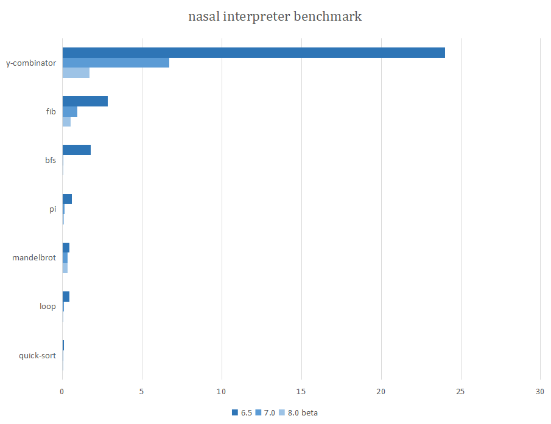
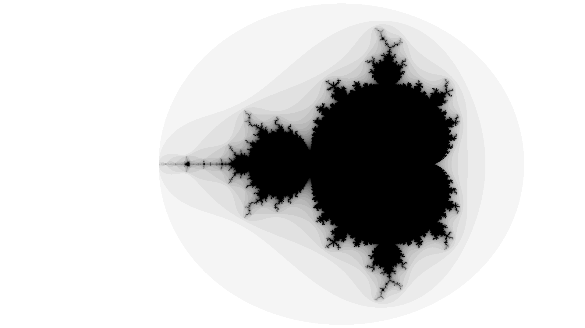
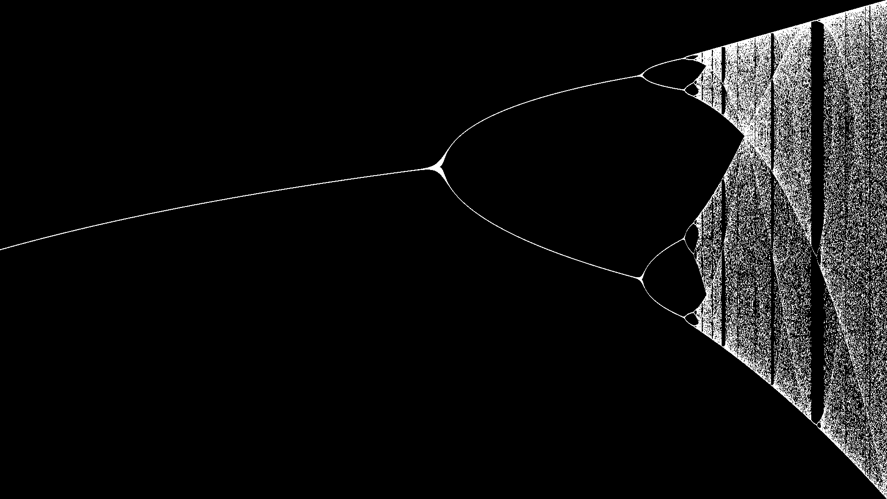

# __Benchmark__

## version 6.5 (i5-8250U windows10 2021/6/19)

running time and gc time:

|file|call gc|total time|gc time|
|:----|:----|:----|:----|
|pi.nas|12000049|0.593s|0.222s|
|fib.nas|10573747|2.838s|0.187s|
|bp.nas|4419829|1.99s|0.18s|
|bigloop.nas|4000000|0.419s|0.039s|
|mandelbrot.nas|1044630|0.433s|0.041s|
|life.nas|817112|8.557s|0.199s|
|ascii-art.nas|45612|0.48s|0.027s|
|calc.nas|8089|0.068s|0.006s|
|quick_sort.nas|2768|0.107s|0s|
|bfs.nas|2471|1.763s|0.003s|

operands calling frequency:

|file|1st|2nd|3rd|4th|5th|
|:----|:----|:----|:----|:----|:----|
|pi.nas|callg|pop|mcallg|pnum|pone|
|fib.nas|calll|pnum|callg|less|jf|
|bp.nas|calll|callg|pop|callv|addeq|
|bigloop.nas|pnum|less|jf|callg|pone|
|mandelbrot.nas|callg|mult|loadg|pnum|pop|
|life.nas|calll|callv|pnum|jf|callg|
|ascii-art.nas|calll|pop|mcalll|callg|callb|
|calc.nas|calll|pop|pstr|mcalll|jmp|
|quick_sort.nas|calll|pop|jt|jf|less|
|bfs.nas|calll|pop|callv|mcalll|jf|

operands calling total times:

|file|1st|2nd|3rd|4th|5th|
|:----|:----|:----|:----|:----|:----|
|pi.nas|6000004|6000003|6000000|4000005|4000002|
|fib.nas|17622792|10573704|7049218|7049155|7049155|
|bp.nas|7081480|4227268|2764676|2617112|2065441|
|bigloop.nas|4000001|4000001|4000001|4000001|4000000|
|mandelbrot.nas|1519632|563856|290641|286795|284844|
|life.nas|2114371|974244|536413|534794|489743|
|ascii-art.nas|37906|22736|22402|18315|18292|
|calc.nas|191|124|109|99|87|
|quick_sort.nas|16226|5561|4144|3524|2833|
|bfs.nas|24707|16297|14606|14269|8672|

## version 7.0 (i5-8250U ubuntu-WSL on windows10 2021/6/29)

running time:

|file|total time|info|
|:----|:----|:----|
|pi.nas|0.15625s|great improvement|
|fib.nas|0.75s|great improvement|
|bp.nas|0.4218s(7162 epoch)|good improvement|
|bigloop.nas|0.09375s|great improvement|
|mandelbrot.nas|0.0312s|great improvement|
|life.nas|8.80s(windows) 1.25(ubuntu WSL)|little improvement|
|ascii-art.nas|0.015s|little improvement|
|calc.nas|0.0468s|little improvement|
|quick_sort.nas|0s|great improvement|
|bfs.nas|0.0156s|great improvement|

## version 8.0 (R9-5900HX ubuntu-WSL 2022/1/23)

running time:

|file|total time|info|
|:----|:----|:----|
|bf.nas|1100.19s||
|mandel.nas|28.98s||
|life.nas|0.56s|0.857s(windows)|
|ycombinator.nas|0.64s||
|fib.nas|0.28s||
|bfs.nas|0.156s|random result|
|pi.nas|0.0625s||
|bigloop.nas|0.047s||
|calc.nas|0.03125s|changed test file|
|mandelbrot.nas|0.0156s||
|ascii-art.nas|0s||
|quick_sort.nas|0s||

## version 9.0 (R9-5900HX ubuntu-WSL 2022/2/13)

running time:

|file|total time|info|
|:----|:----|:----|
|bf.nas|276.55s|great improvement|
|mandel.nas|28.16s||
|ycombinator.nas|0.59s||
|life.nas|0.2s|0.649s(windows)|
|fib.nas|0.234s|little improvement|
|bfs.nas|0.14s|random result|
|pi.nas|0.0625s||
|bigloop.nas|0.047s||
|calc.nas|0.0469s|changed test file|
|quick_sort.nas|0.016s|changed test file:100->1e4|
|mandelbrot.nas|0.0156s||
|ascii-art.nas|0s||

`bf.nas` is a very interesting test file that there is a brainfuck interpreter written in nasal.
And we use this bf interpreter to draw a mandelbrot set.

In 2022/2/17 update we added `\e` into the lexer. And the `bfcolored.nas` uses this special ASCII code. Here is the result:

## More nasal generated pictures

